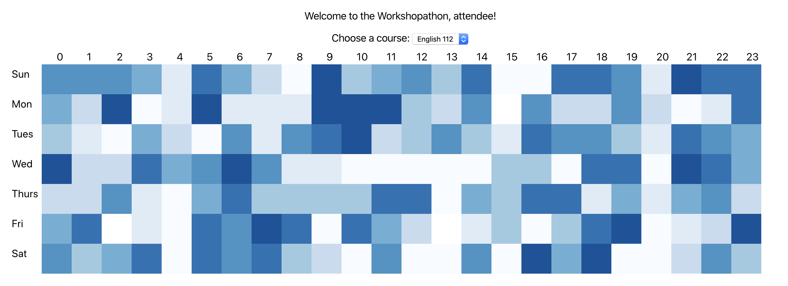

## Table of Contents
1. [You have data, now what?](#you-have-data-now-what)
1. [Discussion component](#discussion-component)
1. [Heatmap component](#heatmap-component)
1. [Next step](#next-step)

## You have data, now what?
In [Step 3](3-Make-API-Calls.md) you fetched discussion data from the `/getDiscussions` endpoint created and set the `discussion` variable. Now we're passing this data from the `App` component to some child [React component](https://reactjs.org/docs/components-and-props.html) that will render the heatmap.

There are two child components that we've prebuilt for you: `Discussion` and `Heatmap`.

The discussion data from `App` will be sent to `Discussion`, which will modify the data and send it to `Heatmap`, which will finally render the heatmap.

## Discussion component
In `App`, you'll see the following line near the bottom:

```js
<Discussion data={discussion} />
```

`Discussion` is a React component that takes one `prop` we named `data`, which you can conceptually think of as an input to the component.

Open up `Discussion`, and you'll see this line:

```js
function Discussion ({ data })
```

We're [destructing](https://hacks.mozilla.org/2015/05/es6-in-depth-destructuring/) the `data` prop from `App`. Then we pull just the `timestamp` field from the data in the following line:

```js
const discussionTimestamps = data
  .map(discussion => discussion.timestamp)
```

Why do this instead of just sending the data as is to `Heatmap`? Well, we designed `Heatmap` to only rely on `timestamps`, and it's better practice to send child components just the data it requires instead of the entire kitchen sink.

Similar to how `App` passed data down to `Discussion`, `Discussion` now passes the `timestamps` down to `Heatmap`:

```js
<Heatmap timestamps={timestamps} />
```

## Heatmap component
Again, we destructure `timestamps` and modify the time to convert it from [UTC](https://www.timeanddate.com/worldclock/timezone/utc) to local time. Then we use [D3.js](https://d3js.org/) to create the heatmap.

You should have something resembling this:


## Next step
How much time do you have left?

### Lots?
Then you're ready to go to [Step 5. Create more advanced data visualizations/tools.](5-Create-Advanced-Data-Viz.md)

### Little?
Then you should go to [Step 6. Share your work.](6-Share-Your-Work.md)
