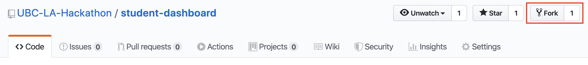
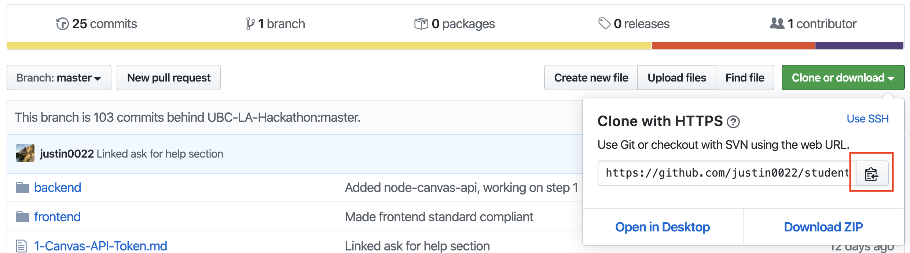
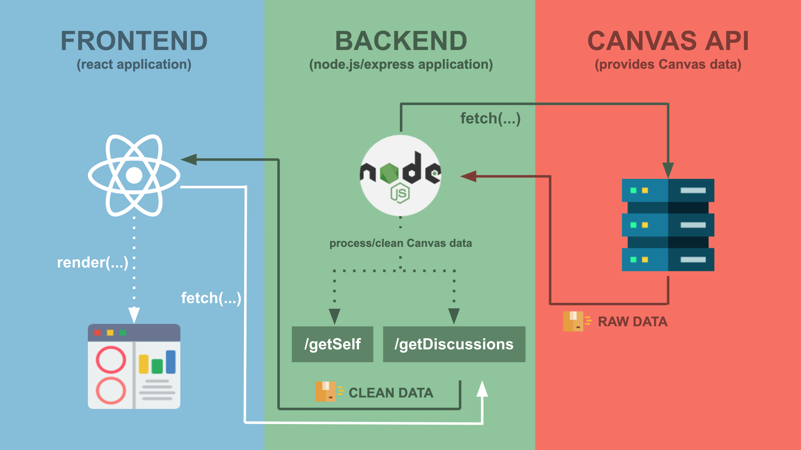

## Virutal Hackathon is happening Sunday, October 25th!

<!-- ALL-CONTRIBUTORS-BADGE:START - Do not remove or modify this section -->

<!-- ALL-CONTRIBUTORS-BADGE:END -->

Welcome to the [7th UBC Learning Analytics hackathon](https://learninganalytics.ubc.ca/for-students/hackathons/). Although the spring 2020 hackathon was cancelled due to COVID-19, the fall 2020 hackathon has gone fully virtual! This hackathon is really a workshop, so we're going to be referring to it as a `workshopathon` from here on out.

This repo contains the basic backend and frontend components of the Student Dashboard application you will be building. By the end of this workshopathon, you should have a working web application that displays your own Canvas data using the Canvas API.

We will also provide other data sources that you are welcome to integrate to build [more advanced tools and visualizations](6-Create-Advanced-Data-Viz.md).

Due to the compressed nature of this workshopathon, we'll be covering a lot of ground in not a lot of time. You don't need to fully understand everything. There are lots of links to external readings and tutorials within [Tasks](#-tasks) that you're welcome to explore. And remember that this repo will always be a resource you can access in the future (so give it a star!)

## Table of Contents
1. [What You'll Learn](#-what-youll-learn)
1. [What You'll Build](#-what-youll-Build)
1. [Ask For Help](#-ask-for-help)
1. [Schedule](#-schedule)
1. [Getting Started](#%EF%B8%8F-getting-started)
1. [Code Overview](#-code-overview)
1. [Tasks](#-tasks)
1. [Project Showcase](#project-showcase)
1. [Organizers](#organizers)
1. [Contributors](#contributors-)

## 📚 What You'll Learn
By completing this workshopathon, you'll learn to:
* use the [Canvas API](https://canvas.instructure.com/doc/api/)
* explore the data that [Canvas collects from you](https://learninganalytics.ubc.ca/ethics-policy/students-learning-analytics-and-privacy/)
* write some code in [JavaScript](https://developer.mozilla.org/en-US/docs/Web/JavaScript)
* learn the difference between the [backend and frontend](https://en.wikipedia.org/wiki/Front_and_back_ends)
* [clean data](https://www.sisense.com/glossary/data-cleaning/)
* build your own [API endpoints](https://www.smashingmagazine.com/2018/01/understanding-using-rest-api/)
* use [React](https://reactjs.org/) to build [frontend components](https://reactjs.org/docs/components-and-props.html)
* build a [modern web application](https://bravoka.io/articles/modern-web-application-frameworks/)

## 🔨 What You'll Build
👉 **[Live demo](https://student-dashboard.netlify.com/)**

You'll be building a web application that displays a [heatmap](https://en.wikipedia.org/wiki/Heat_map) of what days of the week and what time of the day you and your peers (and your instructor) are most actively posting in the discussion forum of a course.

It should look something like this:

After you've completed the heatmap, you can either add more [features to the heatmap](6-Create-Advanced-Data-Viz.md#give-me-ideas) or use the [tons of data we provide](6-Create-Advanced-Data-Viz.md#give-me-data) to build entirely new tools and visualizations.

## 🤔 Ask For Help
We don't expect you to come into the workshopathon with any prior knowledge. You may never have coded before - that's okay! You're here to learn, and we're here to help.

There are many volunteers here with lots of software development experience who are happy to help.

And if you're already comfortable with some of the technology we're using, please help your neighbours!

## 📅 Schedule
### Sunday, October 25th
* 9:00am - Hackathon welcome and orientation - we'll give you an overview of the tasks and get you set up with this repository.
* 9:20am - Start hacking! Solutions to each of the [Tasks](#-tasks) will be released at predetermined times.
* 11:00am - Check-in.
* 1:00pm - Check-in.
* 3:00pm - Check-in.
* 4:30pm - Optional: students who built some of the optional features in [Task 6](6-Create-Advanced-Data-Viz.md) can demo their work!
* 5:30pm - End of Workshopathon.

## ⚙️ Getting Started
These instructions will get you a copy of the project up and running on your local machine for use with your own Canvas API tokens.

### Prerequisites
1. **Install [Node 12.0.0 or greater](https://nodejs.org)**.
1. **Install [Git](https://git-scm.com/downloads)**.
1. **Install [Latest Version of Zoom (5.3 or greater)](https://support.zoom.us/hc/en-us/articles/201362233-Upgrade-update-to-the-latest-version)** (required, since this will allow you to move freely between the various Zoom breakout rooms).
1. **Install [Visual Studio Code](https://code.visualstudio.com/)** (optional but recommended).
1. **Install [Brave](https://brave.com/) or [Firefox](https://www.mozilla.org/en-CA/firefox/), since [Chrome is spyware](https://www.washingtonpost.com/technology/2019/06/21/google-chrome-has-become-surveillance-software-its-time-switch/)** (optional but recommended; the volunteers are more familiar with using the devtools of Brave or Firefox).

### Installation and setup
1. Fork this repo.

1. Copy clone link.

1. Open terminal on Mac or command line on Windows. We like to use [VSCode's integrated terminal](https://code.visualstudio.com/docs/editor/integrated-terminal), as it works for both Mac and PC.
1. Clone repo. `git clone {paste URL you copied}`
1. Navigate into repo. `cd student-dashboard`

#### Backend
1. Navigate into `backend` repo. `cd backend`
1. Install required dependencies. `npm install`
1. Start server. `npm start`
1. In terminal, you should see `Example app listening on port 4001!`.

#### Frontend
1. Navigate into `frontend` repo. `cd frontend`
1. Install required dependencies. `npm install`
1. Start frontend application. `npm start`
1. Your browser should start. If not, navigate to http://localhost:3000/. You should see `Welcome to the Workshopathon, attendee!`.

## 💾 Code Overview
### Dependencies
#### Backend
* [nodejs](https://nodejs.org/en/) - JavaScript runtime.
* [expressjs](https://expressjs.com/) - A framework for building our server's API endpoints.
* [cors](https://expressjs.com/en/resources/middleware/cors.html) - A middleware to enable [Cross-Origin Resource Sharing](https://en.wikipedia.org/wiki/Cross-origin_resource_sharing).
* [node-canvas-api](https://github.com/ubccapico/node-canvas-api) - Easy way to make calls to Canvas API using JavaScript.
* [neat-csv](https://github.com/sindresorhus/neat-csv) - Simple way to read CSV files.

#### Frontend
* [reactjs](https://reactjs.org/) - JavaScript library for building user interfaces.
* [Victory](https://formidable.com/open-source/victory/) - React components for easily building data visualizations.
* [D3.js](https://d3js.org/) - The de facto way to build data visualizations on the web, somewhat painfully.

### Application Structure

Our web application will involve three autonomous entities (two of which we build):
* a **frontend** React application
* a **backend** Node.js/Express application
* the **Canvas  API** (accessed through node-canvas-api)

These three entities run independently but communicate with one another by exchanging data via API endpoints. Our Node backend will be responsible for querying the Canvas API, processing the data returned, and hosting that data at API endpoints (that we create) for our frontend application to read and render to the browser.

#### Backend
* [`server.js`](./backend/server.js) - The entry point into our backend code. It starts the express server and is responsible for handling requests the frontend makes, making requests to the Canvas API, and reading/sending data to the frontend.
* [`canvasDiscussions.js`](./backend/canvasDiscussions.js) - Exports two functions, `getDiscussions` and `flattenTopicAndReplies`. The first takes as input a Canvas course id and pulls discussions from that course in a way that preserves the threaded nature of replies to discussion topics. The second flattens the topics and replies to make it easier for generating the heatmap.
* [`readCSV.js`](./backend/readCSV.js) - Simple utility for reading CSVs painlessly. Takes as input the path to the CSV.

#### Frontend
* [`App.js`](./frontend/src/App.js) - The top-level React component that is responsible for rendering the `Discussion` and `Heatmap` components.
* [`Discussion.js`](./frontend/src/components/Discussion.js) - `Discussion` fetches discussion data, cleans it, and passes it down to the child component `Heatmap`.
* [`Heatmap.js`](./frontend/src/components/Heatmap.js) - Renders the heatmap using [D3.js](https://d3js.org/).
* [`Welcome.js`](./frontend/src/components/Welcome.js) - Renders a simple welcome message with the Canvas user's name, if available.

## ✅ Tasks
1. [Create a Canvas API token and make calls to the Canvas API](1-Canvas-API-Token.md)
1. [Create API endpoints in backend](2-API-Endpoints.md)
1. [Make API calls from frontend to frontend](3-Make-API-Calls.md)
1. [Create data visualization dashboard](4-Create-Data-Viz-Dashboard.md)
1. [Create a dropdown to switch between classes](5-Create-Course-Dropdown.md)
1. [Create more advanced data visualizations/tools](6-Create-Advanced-Data-Viz.md)
1. [Share your work](7-Share-Your-Work.md)
1. [Feedback and thanks](8-Feedback-And-Thanks.md)

## Project Showcase
At the end of the workshopathon, you can [put a link to your work here](7-Share-Your-Work.md#share-your-work)!

## Organizers
This hackathon is a collaborative effort by the [UBC Learning Analytics](https://learninganalytics.ubc.ca/) project, [LAVA](https://blogs.ubc.ca/lava/) (Learning Analytics, Visual Analytics), and [Sauder Learning Services](https://www.sauder.ubc.ca/about-ubc-sauder/learning-services), with staff volunteers from [Faculty of Arts](https://www.arts.ubc.ca/), [Faculty of Education](https://educ.ubc.ca/), [Sauder School of Business](https://www.sauder.ubc.ca/), and the [Centre for Teaching, Learning and Technology](https://ctlt.ubc.ca/).

A big thank you to [Sauder Learning Labs](https://www.sauder.ubc.ca/about-ubc-sauder/learning-services/learning-labs) for providing a space designed to facilitate teams in using critical thinking and analytical decision making to solve real-world problems.

## Contributors ✨

And another big thank you to our volunteers and contributors.

<!-- ALL-CONTRIBUTORS-LIST:START - Do not remove or modify this section -->
<!-- prettier-ignore-start -->
<!-- markdownlint-disable -->
<table>
  <tr>
    <td align="center"><a href="https://github.com/markoprodanovic"> <b>Marko Prodanovic</b></a> <a href="https://github.com/UBC-LA-Hackathon/student-dashboard/commits?author=markoprodanovic" title="Documentation">📖</a> <a href="#ideas-markoprodanovic" title="Ideas, Planning, & Feedback">🤔</a> <a href="https://github.com/UBC-LA-Hackathon/student-dashboard/commits?author=markoprodanovic" title="Code">💻</a> <a href="#eventOrganizing-markoprodanovic" title="Event Organizing">📋</a> <a href="https://github.com/UBC-LA-Hackathon/student-dashboard/pulls?q=is%3Apr+reviewed-by%3Amarkoprodanovic" title="Reviewed Pull Requests">👀</a></td>
    <td align="center"><a href="https://github.com/justin0022"> <b>Justin Lee</b></a> <a href="https://github.com/UBC-LA-Hackathon/student-dashboard/commits?author=justin0022" title="Documentation">📖</a> <a href="#ideas-justin0022" title="Ideas, Planning, & Feedback">🤔</a> <a href="https://github.com/UBC-LA-Hackathon/student-dashboard/commits?author=justin0022" title="Code">💻</a> <a href="#eventOrganizing-justin0022" title="Event Organizing">📋</a> <a href="https://github.com/UBC-LA-Hackathon/student-dashboard/pulls?q=is%3Apr+reviewed-by%3Ajustin0022" title="Reviewed Pull Requests">👀</a></td>
    <td align="center"><a href="https://github.com/alisonmyers"> <b>alisonmyers</b></a> <a href="https://github.com/UBC-LA-Hackathon/student-dashboard/commits?author=alisonmyers" title="Documentation">📖</a> <a href="#ideas-alisonmyers" title="Ideas, Planning, & Feedback">🤔</a> <a href="#eventOrganizing-alisonmyers" title="Event Organizing">📋</a> <a href="https://github.com/UBC-LA-Hackathon/student-dashboard/pulls?q=is%3Apr+reviewed-by%3Aalisonmyers" title="Reviewed Pull Requests">👀</a></td>
    <td align="center"><a href="https://github.com/craigdsthompson"> <b>Craig Thompson</b></a> <a href="https://github.com/UBC-LA-Hackathon/student-dashboard/commits?author=craigdsthompson" title="Documentation">📖</a> <a href="#ideas-craigdsthompson" title="Ideas, Planning, & Feedback">🤔</a> <a href="https://github.com/UBC-LA-Hackathon/student-dashboard/commits?author=craigdsthompson" title="Code">💻</a> <a href="#eventOrganizing-craigdsthompson" title="Event Organizing">📋</a> <a href="https://github.com/UBC-LA-Hackathon/student-dashboard/pulls?q=is%3Apr+reviewed-by%3Acraigdsthompson" title="Reviewed Pull Requests">👀</a></td>
    <td align="center"><a href="http://www.stoosepp.com"> <b>Stoo Sepp</b></a> <a href="#ideas-stoosepp" title="Ideas, Planning, & Feedback">🤔</a> <a href="#eventOrganizing-stoosepp" title="Event Organizing">📋</a></td>
    <td align="center"><a href="https://github.com/willengle"> <b>willengle</b></a> <a href="#ideas-willengle" title="Ideas, Planning, & Feedback">🤔</a> <a href="#eventOrganizing-willengle" title="Event Organizing">📋</a></td>
    <td align="center"><a href="https://github.com/sanamsh"> <b>sanamsh</b></a> <a href="#ideas-sanamsh" title="Ideas, Planning, & Feedback">🤔</a> <a href="#eventOrganizing-sanamsh" title="Event Organizing">📋</a></td>
  </tr>
  <tr>
    <td align="center"><a href="https://github.com/vDeo"> <b>Vineet Deo</b></a> <a href="https://github.com/UBC-LA-Hackathon/student-dashboard/commits?author=vDeo" title="Code">💻</a></td>
    <td align="center"><a href="https://github.com/jsondoo"> <b>Jason Doo</b></a> <a href="https://github.com/UBC-LA-Hackathon/student-dashboard/commits?author=jsondoo" title="Code">💻</a></td>
    <td align="center"><a href="https://github.com/Crymzix"> <b>Chris Li</b></a> <a href="https://github.com/UBC-LA-Hackathon/student-dashboard/commits?author=Crymzix" title="Code">💻</a></td>
    <td align="center"><a href="https://github.com/jordancoblin"> <b>jcoblin</b></a> <a href="https://github.com/UBC-LA-Hackathon/student-dashboard/commits?author=jordancoblin" title="Code">💻</a> <a href="https://github.com/UBC-LA-Hackathon/student-dashboard/commits?author=jordancoblin" title="Documentation">📖</a></td>
    <td align="center"><a href="http://riacarmin.com/"> <b>Ria Nicole Carmin</b></a> <a href="https://github.com/UBC-LA-Hackathon/student-dashboard/commits?author=AkimaLunar" title="Code">💻</a></td>
    <td align="center"><a href="https://shirleyyin.com"> <b>Shirley Yin</b></a> <a href="https://github.com/UBC-LA-Hackathon/student-dashboard/commits?author=syin" title="Code">💻</a></td>
    <td align="center"><a href="http://qhou.github.io"> <b>Quinn Hou</b></a> <a href="https://github.com/UBC-LA-Hackathon/student-dashboard/commits?author=qhou" title="Code">💻</a></td>
  </tr>
</table>

<!-- markdownlint-enable -->
<!-- prettier-ignore-end -->
<!-- ALL-CONTRIBUTORS-LIST:END -->

This project follows the [all-contributors](https://github.com/all-contributors/all-contributors) specification. Contributions of any kind welcome!
